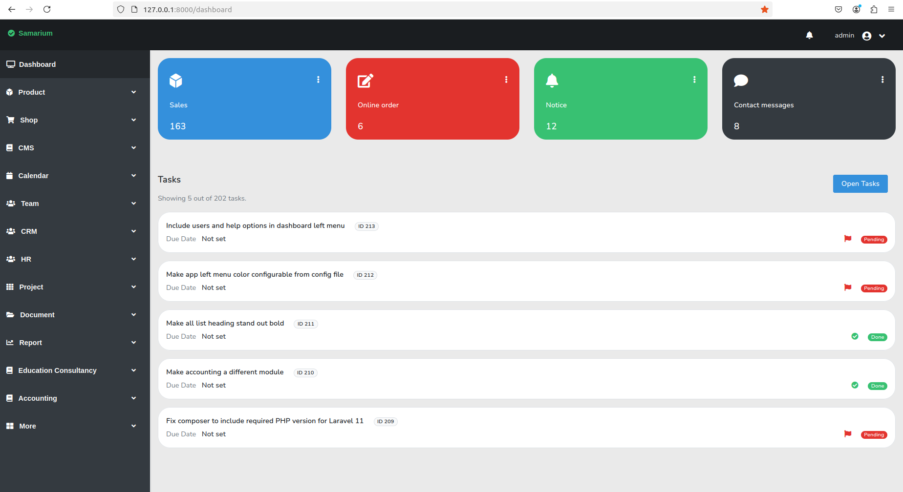

# Samarium


    

Open source ERP built with Laravel and Livewire.



## Features

Feature | Description
------- | -----------
Product | Create products from admin panel. This product can be added to invoices as well as displayed in the website.
Product Category | Arrange products by product categories. 
Invoicing | Create and manage sale invoice, purchase and expense entries.
Website Management (CMS) | Create and manage webpage and blog post entries.
Calendar | Create and manage calendar events.
Team | Create and manage teams.
Contact Message | View contact messages sent by website visitors 
Appointment | Get appointment request from website visitors. Approve or reject from admin panel.
Newsletter subscription | Get newsletter subscription request from website visitors.
Task Manager | Create and manage tasks.


## Installation

It is just another laravel application. So we do all the steps required to get a
laravel application working. 

### Pre requisites

Below applications must be installed in the system. 

```
php >= 8.2
mysql >= 8.0
composer
npm
```

### Step by step instructions

Perform below steps to get the application running.

First create a mysql database. Then grant access to the mysql user. 
Lets assume you created database named `demo_database` and you granted
access to mysql user `demo_user`. You will need this info to enter
in the .env file later.

Clone the repository.

```
$ git clone https://github.com/oitcode/samarium.git
```

Go to the directory.
```
$ cd samarium
```

Copy env.example file to .env file
```
$ cp env.example .env
```

Now, enter database name, mysql username and mysql password in the .env file.
Your .env file's database part should be like this.

```
DB_DATABASE=demo_database
DB_USERNAME=demo_user
DB_PASSWORD='demo_password'
```
Please replace `demo_database`, `demo_user` and `demo_password` with real
database name, username and password.

Install composer dependencies.
```
$ composer install
```

Install npm dependencies.
```
$ npm install
```

Compile front end assets.
```
$ npm run dev
```

Run database migrations.
```
$ php artisan migrate
```

Generate key.
```
$ php artisan key:generate
```

Create storage links.
```
$ php artisan storage:link
```

### Script installation

If you do not want to perform all the installation steps manually,
then there is a bash script provided that will run all the 
required steps.

Please run below bash script.

`bash app-install.sh`

## Creating first user

To use the dashboard, you need a username and password.
Use below seeder file to create first user. This will create
an admin user. After that you can create other users from
dashboard.

`php artisan db:seed --class=UserSeeder`
 
## Running the app

`php artisan serve`

Now open your web browser and visit 
- `127.0.0.1:8000` to see the website
- `127.0.0.1:8000/dashboard` to see the dashboard

## Screenshots

Below are some screenshots.


### GIFs


## Contributing

__Please contribute to this project.__
Contributions are welcome.

## Issues

If you find any issue in this application, you can help by raising an issue
here in our github repo.

## License

[MIT license](https://opensource.org/licenses/MIT).
