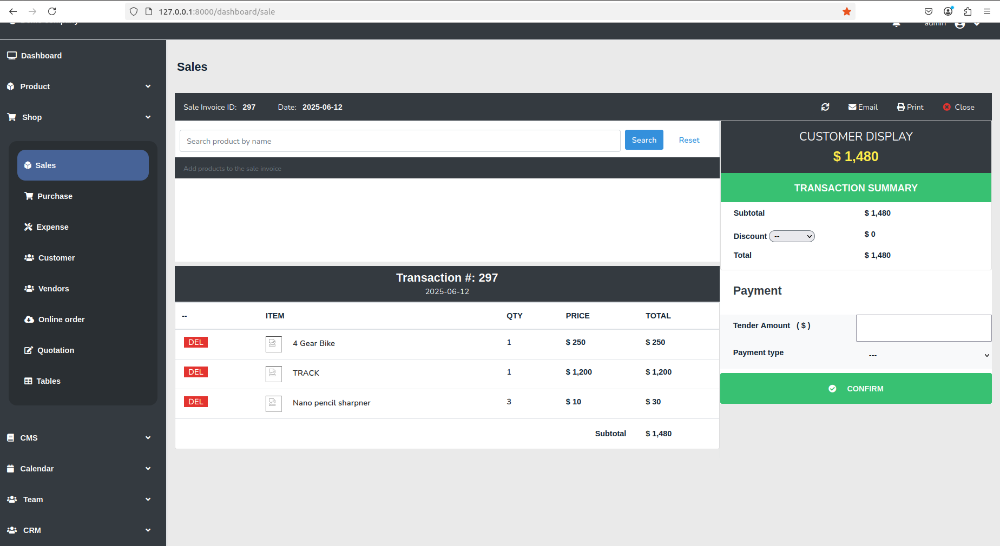

## Samarium

<!--
<div align="center">
# Samarium
</div>

<div align="center">
  
</div>
-->

<div>
         
</div>


Simple ERP to generate invoice, track finance, manage website, manage tasks, etc.

## Installation

### Install with Docker

Perform below steps:

```
git clone https://github.com/oitcode/samarium.git
```

```
cd samarium
```

```
cp .env.docker.example .env
```

> **Note:** You may need to use `sudo` with this command if you have Linux based OS as host.

```
docker-compose up --build -d
```

> **Note:** Below commands need to be run only first time during installation.

> **Note:** You may need to use `sudo` with these commands.

```
docker exec -it samarium_app npm run dev
```

```
docker exec -it samarium_app composer dump-autoload
```

```
docker exec -it samarium_app php artisan migrate
```

```
docker exec -it samarium_app php artisan key:generate
```

```
docker exec -it samarium_app php artisan storage:link
```

```
docker exec -it samarium_app php artisan db:seed
```

> **Note:** This docker setup is a minimal one. Please modify Docker related files accoring to your needs.

#### Running the app

Open your web browser and visit 
- `127.0.0.1:8000` to see the website
- `127.0.0.1:8000/dashboard` to see the dashboard

### Installation without Docker

#### Dependencies 

Below applications must be installed in the system. 

```
php >= 8.2
mysql >= 8.0
composer
nodejs
npm
```

#### Step by step instructions

```
git clone https://github.com/oitcode/samarium.git
```

```
cd samarium
```

```
cp .env.example .env
```

Now create a mysql database. Then grant access to the mysql user. 
Lets assume you created database named `demo_database` and you granted
access to mysql user `demo_user`. Next, enter database name, mysql username
and mysql password in the .env file.  Your .env file's database part should
be like this.

```
DB_DATABASE=demo_database
DB_USERNAME=demo_user
DB_PASSWORD='demo_password'
```
Please replace `demo_database`, `demo_user` and `demo_password` with real
database name, username and password.

```
composer install
```

```
npm install
```

```
npm run dev
```

```
php artisan migrate
```

```
php artisan key:generate
```

```
php artisan storage:link
```

```
php artisan db:seed
```

> **Note:** Seeder files will create first admin user, basic webpages
> of a typical website - Webpage like About us, Calendar, Noticeboard,
> Gallery and Contact us are created - and few other things. Please
> check seeder files in `database/seeder` if you want to see what
> database seeding is done.

#### Running the app

```
php artisan serve
```

Now open your web browser and visit 
- `127.0.0.1:8000` to see the website
- `127.0.0.1:8000/dashboard` to see the dashboard

## Screenshots

Below are some screenshots.





<!--
## GIFs


-->

#### ## Configuration
#### 
#### Please check `app/config.php` file to see different configuration options
#### for the application.
#### 
#### ### Module configuration
#### 
#### Modules can be enabled or disabled through the configuration file.
#### 
#### #### Configuration Location
#### 
#### Module settings are stored in `config/app.php` using an associative array with boolean values:
#### 
#### ```
#### 'modules' => [
####     'dashboard' => true,
####     'product'   => true,
####     'shop'      => true,
####     // Additional modules...
####     'analytics' => false,  // Disabled module
#### ],
#### ```
#### 
#### #### Enabling/Disabling Modules
#### 
#### To enable a module, set its value to true. To disable a module, set its value to false.
#### 
#### #### Usage in Code
#### 
#### You can check if a module is enabled using Laravel's configuration helper:
#### 
#### ```
#### if (config('app.modules.product')) {
####     // Product module is enabled
#### }
#### ```
#### 
#### Or you can use `has_module` helper function:
#### 
#### ```
#### if (has_module('calendar'))
####     // Calendar module is enabled
#### }
#### ```
#### 
#### ### Admin panel color configuration
#### 
#### Color settings for dashboard / admin panel can be configured from `config/app.php` file.  
#### Values for these options are bootstrap color classes.
#### 
#### ```
#### 'app_menu_dropdown_button_text_color' => 'text-white',
#### 'app_menu_normal_button_text_color'   => 'text-white',
#### 'app_menu_bg_color'                   => 'bg-dark',
#### 
#### 'app_top_menu_bg_color'               => 'bg-light',
#### 'app_top_menu_text_color'             => 'text-dark',
#### ```
#### 
#### ## Website Header/Footer Configuration
#### 
#### Public facing website can be accessed in `127.0.0.1:8000`. Website consists of header, navigation menu, main content and footer. The application supports multiple header and footer templates that can be easily switched through configuration.
#### 
#### ### Header file location
#### 
#### Header blade files are location in below directory:
#### ```
#### resources/views/partials/cms/website/header
#### ```
#### 
#### By default `resources/views/partials/cms/website/header/header-default.blade.php` blade file is used for header. You can modify the default header file there.  However, if you want to have a different header altogether then you can create a new blade file in that directory. Which header file to use can be configured in `footer_blade_file` setting in `config/app.php` file.
#### 
#### ### Header file configuration
#### 
#### To set which header blade file to use, update the `header_blade_file` setting in `app/config.php`:
#### 
#### ```
#### 'header_blade_file' => 'partials.cms.website.header.header-some-name'
#### ```
#### 
#### ### Footer file location
#### 
#### Footer files are location in below directory:
#### ```
#### resources/views/partials/cms/website/footer
#### ``` 
#### By default `resources/views/partials/cms/website/footer/footer-default.blade.php` blade file is used for footer. You can modify the default footer file there. However, if you want to have a different footer altogether then you can create a new file in that directory. Which footer file to use can be configured in `footer_blade_file` setting in `config/app.php` file.
#### 
#### ### Footer file configuration
#### 
#### To set which footer blade file to use, update the `footer_blade_file` setting in `app/config.php`:
#### 
#### ```
#### 'footer_blade_file' => 'partials.cms.website.footer.footer-some-name'
#### ```
#### 
#### ### Example
#### 
#### If you have a header file named `header-corporate.blade.php` in the `resources/views/partials/cms/website/header` directory, configure it as below in `config/app.php` file:
#### 
#### ```php
#### 'header_blade_file' => 'partials.cms.website.header.header-corporate'
#### ```
#### 
#### If you have a footer file named `footer-corporate.blade.php` in the `resources/views/partials/cms/website/footer` directory, configure it as below in `config/app.php` file:
#### 
#### ```php
#### 'footer_blade_file' => 'partials.cms.website.footer.footer-corporate'
#### ```
#### 
#### > **Note:** This allows you to maintain multiple header and footer designs and switch between them without code changes - simply update the configuration file.
#### 
#### ### Available Data & Styling
#### 
#### **Company Information**
#### The `$company` object is globally available in all Blade files, providing access to:
#### ```blade
#### {{ $company->name }}
#### {{ $company->phone }}
#### {{ $company->email }}
#### {{ $company->address }}
#### {{ $company->brief_descriptoin }}
#### ```
#### 
#### **CSS Framework**
#### Header and Footer templates can use Bootstrap 4 classes for styling:
#### 
#### Example:
#### 
#### ```blade
#### <footer class="bg-dark text-white py-4">
####     <div class="container">
####         <div class="row">
####             <div class="col-md-6">
####                 <h5>{{ $company->name }}</h5>
####                 <p class="text-muted">{{ $company->address }}</p>
####             </div>
####             <div class="col-md-6 text-right">
####                 <p>Call us: {{ $company->phone }}</p>
####             </div>
####         </div>
####     </div>
#### </footer>
#### ```

## Contributing

Any kind of contributions are welcome.

## Issues

For bugs or feature request, open an issue on Github. 

## License

This project is licensed under the [MIT license](https://opensource.org/licenses/MIT)
