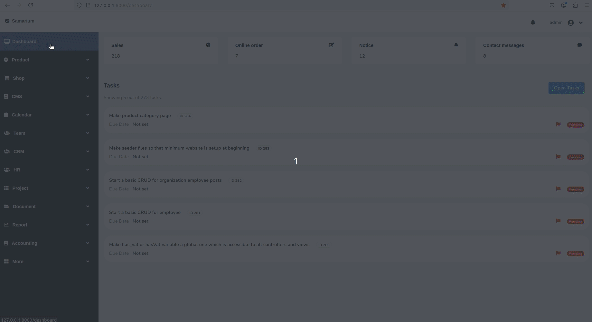

## Samarium

<!--
<div align="center">
# Samarium
</div>

<div align="center">
  
</div>
-->

<div>
         
</div>



## Installation

### Install with Docker

Perform below steps:

```
git clone https://github.com/oitcode/samarium.git
```

```
cd samarium
```

```
cp .env.docker.example .env
```

> **Note:** You may need to use `sudo` with this command if you have Linux based OS as host.

```
docker-compose up --build -d
```

> **Note:** Below commands need to be run only first time during installation.

> **Note:** You may need to use `sudo` with these commands.

```
docker exec -it samarium_app npm run dev
```

```
docker exec -it samarium_app composer dump-autoload
```

```
docker exec -it samarium_app php artisan migrate
```

```
docker exec -it samarium_app php artisan key:generate
```

```
docker exec -it samarium_app php artisan storage:link
```

```
docker exec -it samarium_app php artisan db:seed
```

> **Note:** This docker setup is a minimal one. Please modify Docker related files accoring to your needs.

#### Running the app

Open your web browser and visit 
- `127.0.0.1:8000` to see the website
- `127.0.0.1:8000/dashboard` to see the dashboard

### Installation without Docker

#### Dependencies 

Below applications must be installed in the system. 

```
php >= 8.2
mysql >= 8.0
composer
nodejs
npm
```

#### Step by step instructions

```
git clone https://github.com/oitcode/samarium.git
```

```
cd samarium
```

```
cp .env.example .env
```

Now create a mysql database. Then grant access to the mysql user. 
Lets assume you created database named `demo_database` and you granted
access to mysql user `demo_user`. Next, enter database name, mysql username
and mysql password in the .env file.  Your .env file's database part should
be like this.

```
DB_DATABASE=demo_database
DB_USERNAME=demo_user
DB_PASSWORD='demo_password'
```
Please replace `demo_database`, `demo_user` and `demo_password` with real
database name, username and password.

```
composer install
```

```
npm install
```

```
npm run dev
```

```
php artisan migrate
```

```
php artisan key:generate
```

```
php artisan storage:link
```

```
php artisan db:seed
```

> **Note:** Seeder files will create first admin user, basic webpages
> of a typical website - Webpage like About us, Calendar, Noticeboard,
> Gallery and Contact us are created - and few other things. Please
> check seeder files in `database/seeder` if you want to see what
> database seeding is done.

#### Running the app

```
php artisan serve
```

Now open your web browser and visit 
- `127.0.0.1:8000` to see the website
- `127.0.0.1:8000/dashboard` to see the dashboard

## Screenshots

Below are some screenshots.


<!--
## GIFs


-->

## Configuration

Please check `app/config.php` file to see different configuration options
for the application.

<!--Below are some configuration options you may want to
change.  

File:                    `app/config.php`
Configurable option:     `App menu color options`

```
'app_menu_dropdown_button_text_color' => 'text-white',
'app_menu_normal_button_text_color'   => 'text-white',
'app_menu_bg_color'                   => 'bg-dark',

'app_top_menu_bg_color'               => 'bg-light',
'app_top_menu_text_color'             => 'text-dark',
```
-->

## Contributing

Any kind of contributions are welcome.

## Issues

For bugs or feature request, open an issue on Github. 

## License

This project is licensed under the [MIT license](https://opensource.org/licenses/MIT)
